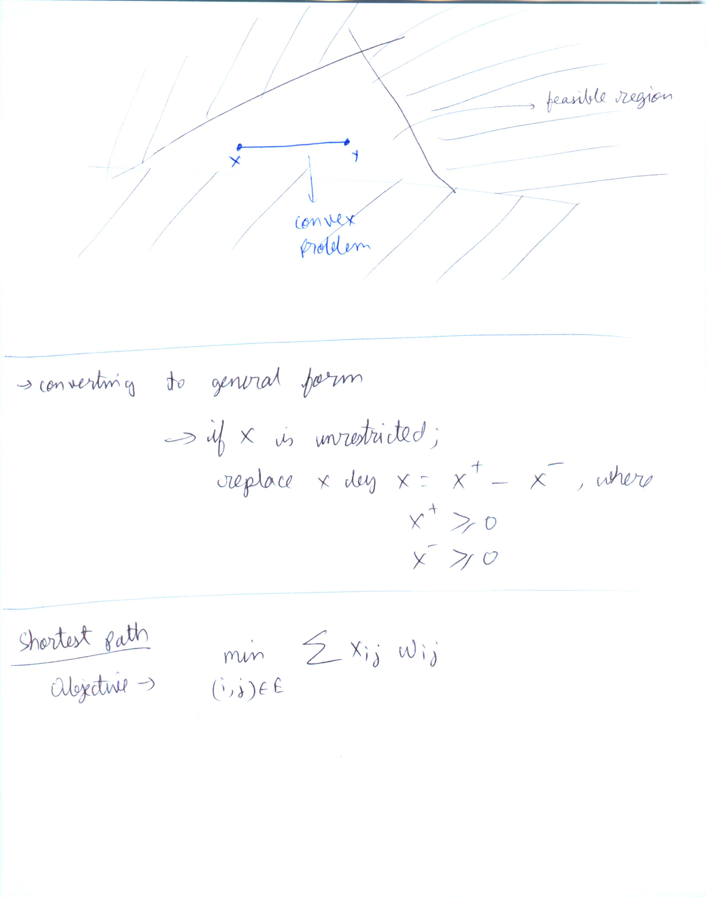
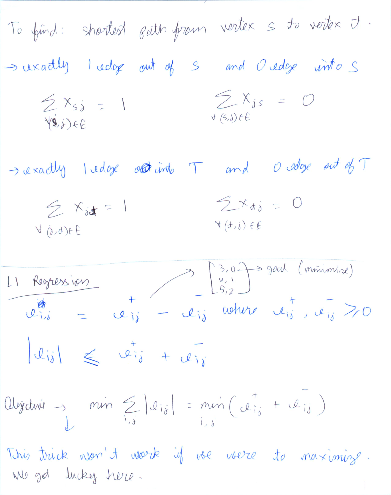

* This markdown complements the lecture notes. Refer L6-8.pdf
* **Unreasonable effectiveness of linear programming**
* Good tool to have in the algorithms toolkit.
* If you can model your problem as a linear program, you can make use of many software solvers out in the market
* Job assignment problem.
  * Convince yourself that the greedy method won't work. There will be lot of contentions. When you do "max"/"min" for greedy, you miss out on information valuable to get optimal answer here
  * Practical example https://www.youtube.com/watch?v=pFu5xmA-Vo0
  * Related
    * https://en.wikipedia.org/wiki/Hungarian_algorithm
    * https://en.wikipedia.org/wiki/Assignment_problem#Solution_by_linear_programming
  * Dunno if lec6_updated.pdf is actually updated
* Shortest path in graph. If weights>=0, Dijkstra. If weights ><0, bellman ford. What if we modelled shorted path as a linear programming problem.

* Duality
* min max
max min

