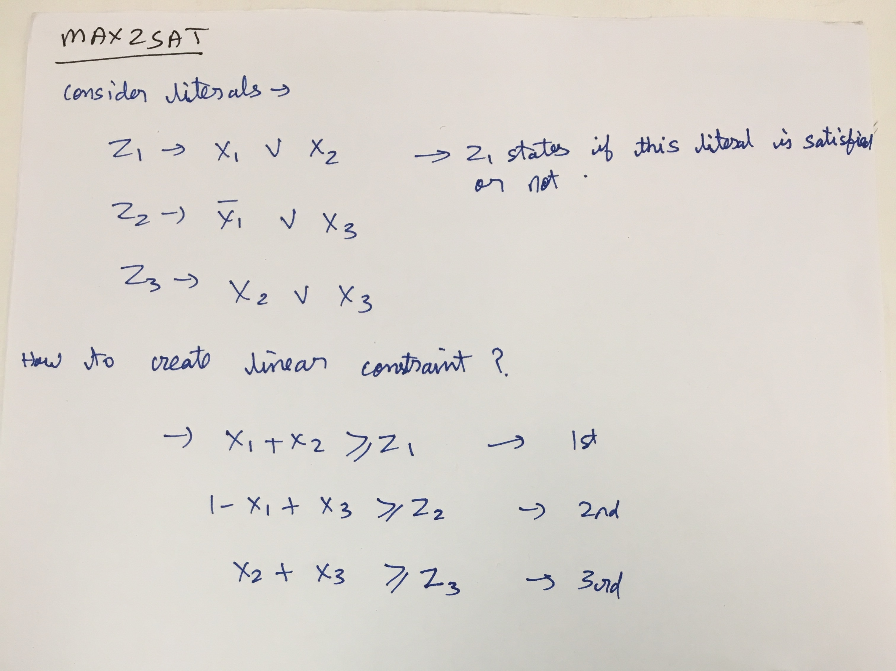

* **Refer lecture notes**
* Vertex cover
  * This is an NP hard problem
  * Generally i have seen edges having weights. In this problem, the vertices have weights associated with them

* Question-
  * in slides, min, u \in V in the summation. on the board, v \in V in summation
  * on board, why no constraint on xv \in {0,1}. Is that redundant?
  * Proof of lemma 4.2.

* Max2SAT
  * Literals are OR operators here
  * 2CNF. If a solution exists that solves all literals, that solution can be found in polynomial time via DFS. But if a solution doesn't exist, maximizing number of literals satisfied is NP hard
  * For 3CNF, even if solution exists that solves all literals, its still NP hard to find them
  * Randomized algorithm
  * 2nd rounding trick

